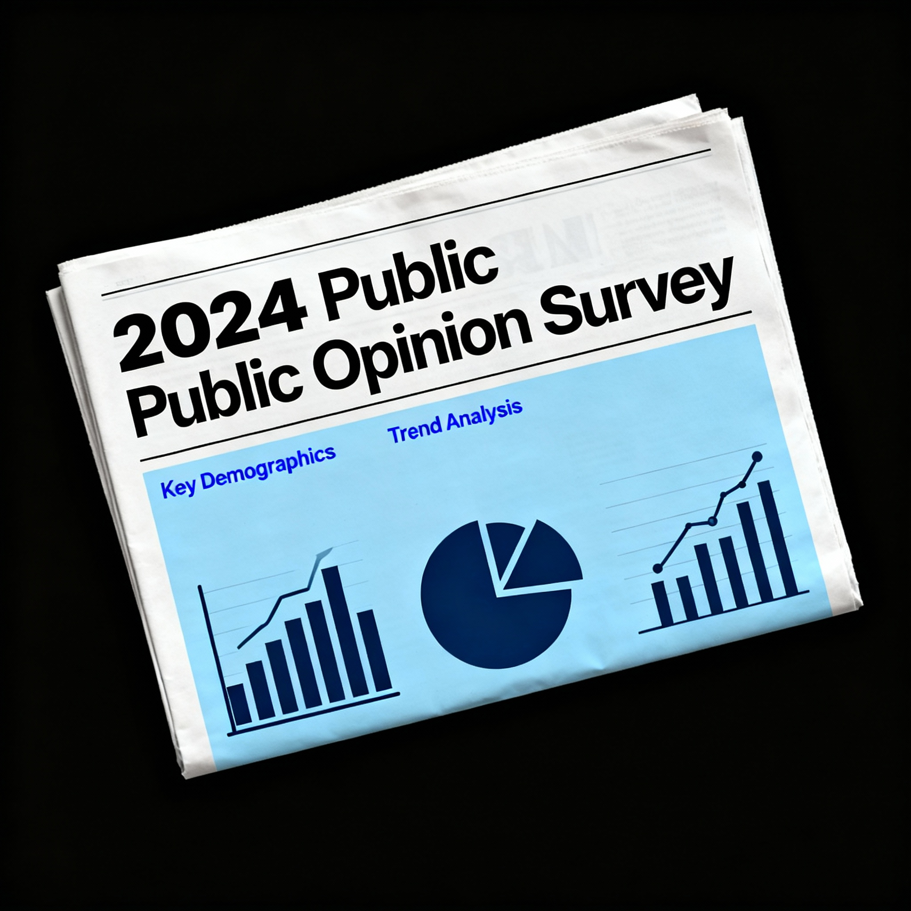
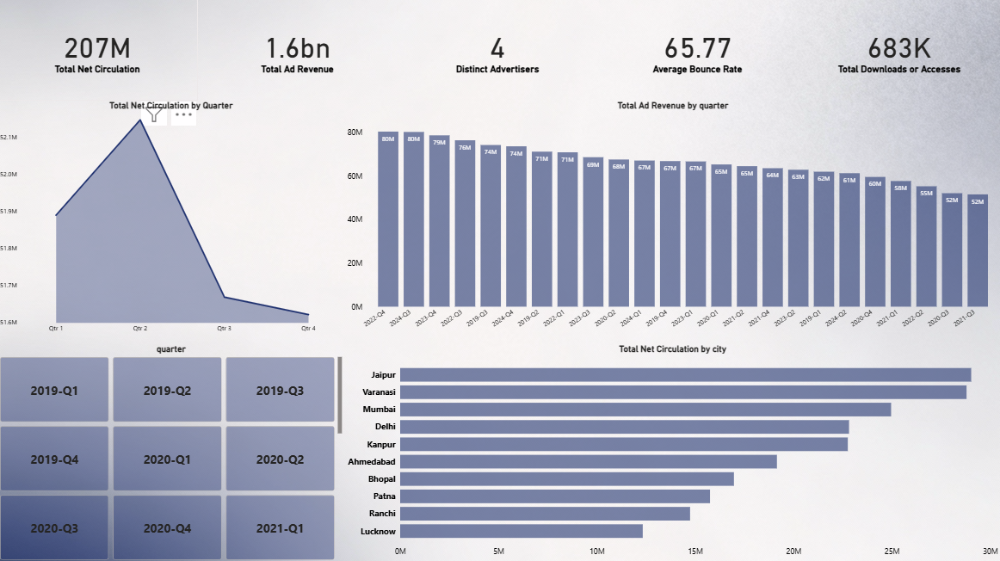
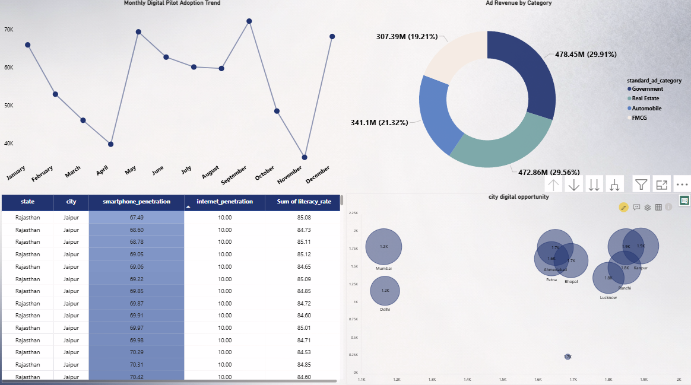

# Bharat Herald: Data-Driven Business & Digital Transformation Dashboard

  

## 📊 Project Overview

**Bharat Herald** is a legacy newspaper organization facing an existential crisis amidst rapid digital migration, declining print circulation, and increased competition. This repo presents a comprehensive business intelligence and digital transformation analysis covering the period **2019–2024**, targeting actionable executive insights, recovery strategies, and a modern corporate dashboard.

---

## 🚀 Key Objectives

- **Quantify business challenges:** Analyze multi-year trends for print circulation, ad revenue, and digital pilot engagement.
- **Identify recovery potential:** Map digital readiness by region, highlight growth opportunities, and segment advertisers by resilience.
- **Recommend a digital-first roadmap:** Present data-driven steps for leadership to regain market position, rebuild ad relationships, and deploy pilot projects.

---
## 🏗️ Data Modelling

This project uses a **star schema** data model to organize and relate disparate business facts for powerful insights and analysis. Core entities are separated into **fact tables** (quantitative events) and **dimension tables** (context and attributes):

### Entity Overview

- **Fact Tables**
  - `fact_print_sales`: Contains print circulation, copies sold, returns, net circulation, and time period
  - `fact_ad_revenue`: Tracks advertisement revenue, ad category, and partner information by time period
  - `fact_digital_pilot`: Digital engagement events—downloads, bounce rates, feedback, etc.
  - `fact_city_readiness`: Smartphone/internet penetration, literacy, and city-level digital metrics

- **Dimension Tables**
  - `dim_city`: City details including state, tier classification, and name
  - `dim_ad_category`: Standardized ad category definitions for merging with ad revenue

### Relationships

- Facts are linked to dimensions via foreign key fields (e.g., `City_ID`, `Ad_Category_ID`)
- Date fields enable flexible time-based analysis (month/quarter/year)
- Data is normalized and cleaned for consistent reporting

### Modeling Approach

- All transformations performed in Power BI Power Query and Python Pandas scripts
- Relationships established in Power BI Model View for interactive visuals
- Measures calculated with robust DAX expressions for KPIs and derived metrics (e.g., Net Circulation, Opportunity Score)

### Benefits

- Enables cross-domain trend analysis (print, ad, digital)
- Supports executive drill-through from summary metrics to granular details
- Modular structure allows easy extension with new datasets or dimensions

*See `/powerbi/Bharat_Herald_Dashboard.pbix` for full model and schema diagram.*

---
## 📺 Dashboard Highlights

- **KPI executive overview:** Total net circulation, ad revenue, digital engagement metrics.
- **Trend visuals:** Time-series for print decline, ad revenue loss, and failed digital pilot analysis.
- **City-wise opportunity mapping:** Regional penetration, readiness scores, top expansion targets.
- **Ad/Advertiser breakdowns:** Category insights using donut and bubble charts, resilience analytics.
- **Actionable summary:** Executive recommendations powered by data, not assumptions.

---

## 🛠️ Tech Stack

- **Power BI** (Primary): Interactive dashboard/reporting
- **Python (Pandas, Matplotlib)**: Data cleaning, transformation, and supplemental analysis
- **SQL**: Fact/dimension model building, ad-hoc business queries
- **Excel / Power Query**: Data wrangling and normalization
- **Git/GitHub**: Version control and collaboration

---

## 💎 Impact

- Synthesized 5 years’ business data into a unified BI dashboard for leadership and investors.
- Identified top digital-ready cities and high-potential advertiser segments for immediate action.
- Delivered a clear, actionable roadmap for Bharat Herald’s recovery and digital growth.

